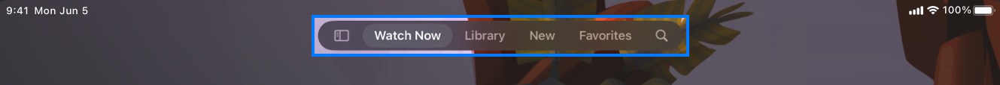

In iPadOS 18 and later, [the default look and position of a tab bar has changed](https://developer.apple.com/documentation/uikit/elevating-your-ipad-app-with-a-tab-bar-and-sidebar). It now floats over your content at the top. 



Overall, it’s a welcome change. Your app gets more space for content.

But what if you want your tab bar to stay consistent, same look and position, across all OS versions? 

That’s surprisingly hard to do. 

Chances are you’ve already customized the tab bar and now need to hide the new elevated one. Let’s go over your options depending on the minimum deployment target.

### Minimum deployment target: iOS 13

There’s no official API to hide the default tab bar. You’ll need a workaround. 

You can traverse the view hierarchy, find the `UITabBarController`, and manually hide the tab bar: 

```swift
struct HiddenTabBar: UIViewRepresentable {
  init() {
    UITabBar.appearance().isHidden = true
  }

  func makeUIView(context: Context) -> UIView {
    let view = UIView()
    view.backgroundColor = .clear

    DispatchQueue.main.async {
      if let tabController = view.tabBarController {
        UITabBar.appearance().isHidden = false

        if #available(iOS 18.0, *) {
          tabController.isTabBarHidden = true
        } else {
          tabController.tabBar.isHidden = true
        }
      }
    }
    return view
  }
}

// Usage
var body: some View {
  TabView {
    Text("Hello, world!")
    .tabItem { 
      Label("1", systemImage: "1.circle")
    }
    .background {
      HiddenTabBar() // The workaround to hide a tab bar
    }
  }
}
```

If Apple changes how the tab bar is implemented internally, your app may break. 

### Minimum deployment target: iOS 16

Apple introduced a [new API to hide the default look of a tab bar](https://developer.apple.com/documentation/swiftui/view/toolbar(_:for:)):

```swift
ContentView()
  .toolbar(.hidden, for: .navigationBar, .tabBar)
```

Unfortunately, there’s a bug. When switching tabs programmatically, the tab bar reappears.

### Minimum deployment target: iOS 18

Apple introduced another [new API](https://developer.apple.com/documentation/swiftui/view/toolbarvisibility(_:for:)), and this one works as expected: 

```swift
ContentView()
  .toolbarVisibility(.hidden, for: .navigationBar, .tabBar)
```

But let’s be real, not many apps are shipping with iOS 18 as their minimum version yet. 

So, if hiding the elevated tab bar isn’t reliable or available, how do we solve this?

By fully customizing the tab bar, the right way. 

### A custom tab bar

There are thousands of tutorials on how to do it, but most of them either rely on fragile workarounds or skip over key details. 

Turns out, making a custom tab bar is actually simple. It only takes 4 steps:

1. Inherit `UITabBarController`. 
2. Hide the system tab bar.
3. Adjust the safe area. 
4. Build your custom tab bar view. 

```swift
// copy from real-life example

class TabBarController: UITabBarController { // 1
  override func viewDidLoad() {
    super.viewDidLoad()

	// 1️⃣
    let tabBarHeight = 45.0
    let bottomPadding = UIApplication.shared.windows
            .first?.safeAreaInsets.bottom ?? 0
    let customTabBarHeight = tabBarHeight + bottomPadding

    // 2️⃣
    if #available(iOS 18.0, *) {
      isTabBarHidden = true
    else {
      tabBar.isHidden = true
    }
	
	// Make the tab bar opaque
	tabBar.isTranslucent = false

    // 3️⃣
    additionalSafeAreaInsets = UIEdgeInsets(
        top: 0, left: 0, bottom: tabBarHeight, right: 0
    )

    // 4️⃣
    let customTabBar: UIView = ... 
    view.addSubview(customTabBar)

    customTabBar.translatesAutoresizingMaskIntoConstraints = false
        NSLayoutConstraint.activate([
            customTabBar.leadingAnchor.constraint(equalTo: view.leadingAnchor),
            customTabBar.trailingAnchor.constraint(equalTo: view.trailingAnchor),
            customTabBar.heightAnchor.constraint(equalToConstant: customTabBarHeight),
            customTabBar.bottomAnchor.constraint(equalTo: view.bottomAnchor)
        ])
  }
}
```

Adjusting `additionalSafeAreaInsets` ensures your content won’t sit under your custom tab bar.

Happy building! 